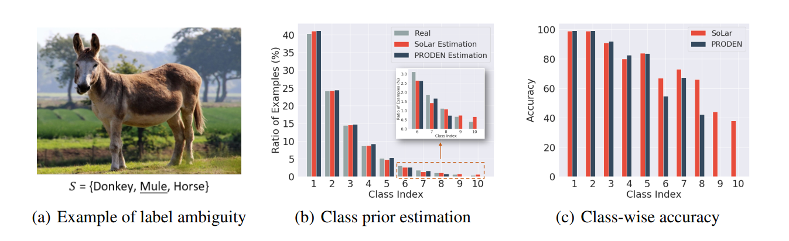
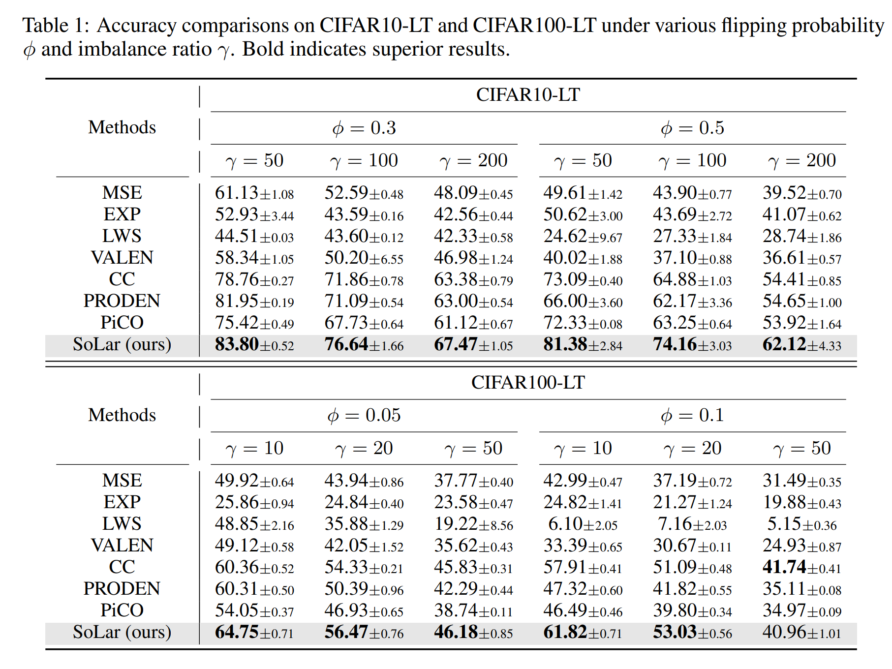
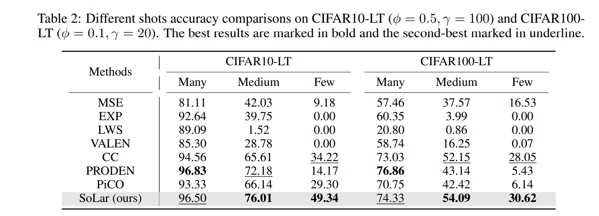
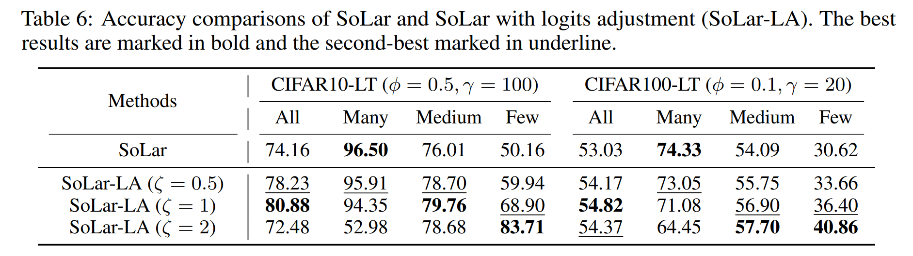

# SoLar: Sinkhorn Label Refinery for Imbalanced Partial-Label Learning

This is a [PyTorch](http://pytorch.org) implementation of our **NeurIPS 2022** paper [SoLar](https://arxiv.org/abs/2209.10365). 

**Title:** SoLar: Sinkhorn Label Refinery for Imbalanced Partial-Label Learning

**Authors:** Haobo Wang, Mingxuan Xia, Yixuan Li, Yuren Mao, Lei Feng, Gang Chen, Junbo Zhao

```
 @article{wang2022solar,
      title={SoLar: Sinkhorn Label Refinery for Imbalanced Partial-Label Learning},
      author={Wang, Haobo and Xia, Mingxuan and Li, Yixuan and Mao, Yuren and Feng, Lei and Chen, Gang and Zhao, Junbo},
      journal={NeurIPS},
      year={2022}
 } 
```

## Start Running SoLar

**Data Preparation**

For CIFAR datasets, one can directly run the shell codes. 

For the CUB200 dataset, we provide a preprocessed copy [here](https://drive.google.com/file/d/1KNMPuKT1q3a6zIEgStar2o4xjs_a3Kge/view?usp=sharing) and just put the files to ```data/cub200/processed``` .

For the SUN397 dataset, we modified the source code of ```torchvision.datasets.SUN397``` ([link](https://pytorch.org/vision/main/generated/torchvision.datasets.SUN397.html))  to implement the dataset class. Please [download](http://vision.princeton.edu/projects/2010/SUN/SUN397.tar.gz) this dataset to the data directory. 

**Start Running**

We provide the following shell codes for model training. Note that we implemented two methods (online/offline) for estimating the class prior. The offline mode requires traveling the whole dataset again, while the online mode does not. We particularly suggest using the online mode for the large-scale SUN397 dataset.

```shell
# Run CIFAR-10
CUDA_VISIBLE_DEVICES=0 python -u train.py --exp-dir experiment/CIFAR-10 \
  --dataset cifar10 --num-class 10 --partial_rate 0.5 --imb_type exp --imb_ratio 100\
  --est_epochs 100 --rho_range 0.2,0.6 --gamma 0.1,0.01

# Run CIFAR-100
CUDA_VISIBLE_DEVICES=1 python -u train.py --exp-dir experiment/CIFAR-100 \
  --dataset cifar100 --num-class 100 --partial_rate 0.1 --imb_type exp --imb_ratio 20\
  --est_epochs 20 --rho_range 0.2,0.5 --gamma 0.05,0.01

# Run CUB-200
CUDA_VISIBLE_DEVICES=2 python -u train.py --exp-dir experiment/CUB200 --data-dir ~/cub200/\
   --dataset cub200 --num-class 200 --partial_rate 0.05 --imb_type exp --imb_ratio 5 \
   --epochs 500 --queue_length 8 --batch-size 128 --lr 0.01 --wd 1e-5 --cosine \
   --est_epochs 20 --rho_range 0.2,0.5 --gamma 0.05,0.01

# Run SUN-397
CUDA_VISIBLE_DEVICES=3 python -u train_online.py --exp-dir experiment/SUN397 --data-dir ~/sun397\
   --dataset sun397 --num-class 397 --partial_rate 0.05 \
   --epochs 200 --queue_length 16 --batch-size 128 --lr 0.01 --wd 1e-5 --cosine \
   --est_epochs 20 --rho_range 0.2,0.5 --gamma 0.05,0.01
```

## Results

**The biased pseudo-labels in PLL.**



(a) An input image with three candidate labels, where the ground-truth is Mule. (b) The real/estimated class distribution (by counting real/predicted labels) on a long-tailed version of CIFAR10 dataset with partial labels (more details in Section 4). The class prior estimated by SoLar is very close to the real one, while PRODEN fails to recognize some tail labels. (c) Class-wise performance comparison of PRODEN and SoLar on the same dataset, where SoLar performs much better on data-scarce classes.

**Main results of SoLar.**

Performance comparisons on CIFAR10-LT and CIFAR100-LT datasets. 



**Few-Shot Accuracy of SoLar.**

Different shots accuracy comparisons.



**Incorporating SoLar with long-tailed learning algorithm**

Performance of SoLar with the long-tailed learning algorithm [Logit Adjustment](https://arxiv.org/abs/2007.07314). SoLar-LA further improves upon SoLar by 6.72% on CIFAR10-LT. This suggests that SoLar is compatible with existing LTL methods and opens the door to exploring more advanced LTL techniques.



